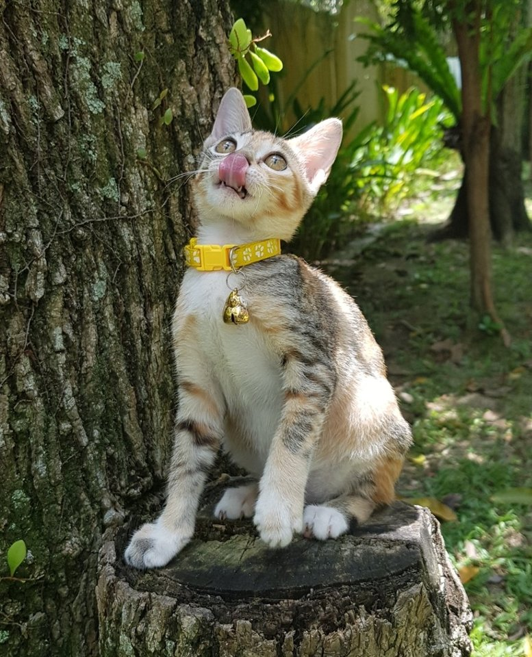

```{r global_options, include=FALSE}
knitr::opts_chunk$set(collapse=TRUE)
```


```{r echo=FALSE,message=FALSE}
library(readr)
library(ggplot2)
library(dplyr)
library(scales)
library(tidyr)
library(lattice)
library(ggmosaic)
library(forcats)
library(plotly)

pet_data <- read_csv("train.csv")
state_labels <- read_csv("state_labels.csv")
```

## Overview
**The dataset our group used is from PetFinder, an Malaysia online community for pet rescuers and adopters to help stray pets find their future home. Our objective is finding certain patterns or trends of those stray pets in Malaysia by analysis and visualization.**


 

## Data Description
*PetID - Unique hash ID of pet profile

*AdoptionSpeed - Categorical speed of adoption. Lower is faster. This is the value to predict. See below section for more info.
0 - Pet was adopted on the same day as it was listed. 
1 - Pet was adopted between 1 and 7 days (1st week) after being listed. 
2 - Pet was adopted between 8 and 30 days (1st month) after being listed. 
3 - Pet was adopted between 31 and 90 days (2nd & 3rd month) after being listed. 
4 - No adoption after 100 days of being listed. (There are no pets in this dataset that waited between 90 and 100 days).

*Type - Type of animal (1 = Dog, 2 = Cat)

*Name - Name of pet (Empty if not named)

*Age - Age of pet when listed, in months

*Breed1 - Primary breed of pet

*Breed2 - Secondary breed of pet, if pet is of mixed breed

*Gender - Gender of pet (1 = Male, 2 = Female)

*Color1 - Main Color of pet

*Color2 - Second Color of pet 

*Maturity Size - Size at maturity (1 = Small, 2 = Medium, 3 = Large, 4 = Extra Large, 0 = Not Specified)

*Fur Length - 1 = Short, 2 = Medium, 3 = Long, 0 = Not Specified

*Vaccinated - Pet has been vaccinated (1 = Yes, 2 = No, 3 = Not Sure)

*Dewormed - Pet has been dewormed (1 = Yes, 2 = No, 3 = Not Sure)

*Sterilized - Pet has been spayed / neutered (1 = Yes, 2 = No, 3 = Not Sure)

*Health - Health Condition (1 = Healthy, 2 = Minor Injury, 3 = Serious Injury, 0 = Not Specified)

*Quantity - Number of pets represented in profile

*Fee - Adoption fee (0 = Free)

*State - State location in Malaysia

*RescuerID - Unique hash ID of rescuer


## Feature Selection
```{r Variance Importance plot, echo=FALSE,message=FALSE}
#title
df_pet<-pet_data
nums <- unlist(lapply(df_pet, is.numeric)) 
num_variable=df_pet[ , nums]
library(randomForest)
set.seed(4543)
data(num_variable)
mtcars.rf <- randomForest(AdoptionSpeed ~ ., data=num_variable, ntree=1000, keep.forest=FALSE,
                          importance=TRUE)
imp=varImpPlot(mtcars.rf)
varImpPlot(mtcars.rf, type=2)
###
imp <- as.data.frame(imp)
imp$varnames <- rownames(imp) # row names to column
rownames(imp) <- NULL  
#####
ggplot(imp, aes(x=reorder(varnames, IncNodePurity), y=IncNodePurity, color=as.factor(varnames))) + 
  geom_point() +
  geom_segment(aes(x=varnames,xend=varnames,y=0,yend=IncNodePurity)) +
  scale_color_discrete(name="Variable Group") +
  ylab("IncNodePurity") +
  xlab("Variable Name") +
  coord_flip()+ggtitle("Feature importance ranking")
```


This feature importance plot showing which feature is the most important for predicting the Adoption speed. We first tunned the model use random forest model. The result showing Age and photo amount is the most important factor for predicting the Adoption speed. then will be breed and color. On the contrary, Video amount and Type seems not that important for the speed of adoption.


## Correlation Matrix
```{r echo=FALSE,message=FALSE}
library(corrplot)
df_pet<-pet_data
nums <- unlist(lapply(df_pet, is.numeric)) 
num_variable=df_pet[ , nums]
res <- cor(num_variable[1:ncol(num_variable)-1])
corrplot(res, type = "upper", order = "hclust", 
         tl.col = "#56B4E9", tl.srt = 45)
```

From this correlation matrics we can see that most features are not correlated which is good. However, Sterilized and Vaccinated, Gender and Quantity, Vaccinated and Dewormed are around 0.7 correlated. This is make sense because Sterlizedm Vaccinated and Dewormed are a serious of health check, so most of them are done together.


## Data Preprocessing 
```{r  echo=FALSE,message=FALSE}
pet <- left_join(pet_data,state_labels,by=c("State"="StateID"))
pet <- mutate(pet,Type=recode(Type, "1"= "Dog", "2"= "Cat"))
pet <- mutate(pet,Gender=recode(Gender, "1"= "Male", "2"= "Female","3"= "Mixed"))
pet <- mutate(pet,MaturitySize=recode(MaturitySize, "0"= "Not Specified","1"= "Small", "2"= "Medium","3"= "Large","4"= "Extra Large"))
pet <- mutate(pet,FurLength=recode(FurLength, "0"= "Not Specified","1"= "Short", "2"= "Medium","3"= "Long"))
pet <- mutate(pet,Vaccinated = recode(Vaccinated, "1"= "Yes", "2"= "No","3"= "Not Sure"))
pet <- mutate(pet,Dewormed = recode(Dewormed, "1"= "Yes", "2"= "No","3"= "Not Sure"))
pet <- mutate(pet,Sterilized = recode(Sterilized, "1"= "Yes", "2"= "No","3"= "Not Sure"))
pet <- mutate(pet,Health = recode(Health, "0"= "Not Sure","1"= "Healthy", "2"= "Minor Injury","3"= "Serious Injury"))
pet <- mutate(pet, Age = (Age/12))
pet <- mutate(pet, AdoptionSpeed_Num = AdoptionSpeed)
pet <- mutate(pet,AdoptionSpeed=recode(AdoptionSpeed,"0" = "0-Adopted on the same day",
                                                     "1" = "1-Adopted between 1 and 7 days",
                                                     "2" = "2-Adopted between 8 and 30 days",
                                                     "3" = "3-Adopted between 31 and 90 days",
                                                     "4" = "4-No adoption after 100 days"))

```


## Histogram for Different Adoption Speed
```{r echo=FALSE,message=FALSE}
ggplot(pet)+geom_bar(aes(x=AdoptionSpeed),fill="#56B4E9",width = 0.5)+
  theme(axis.text.x=element_text(angle = 45, hjust = 1)) +ggtitle("Histogram for Different Adoption Speed")
```


Few pets can be adopted in the same day after their information posted. There are a large amount of pets who cannot be adopted after 100 days. Half of stray pets can be adopted within one month.


## Type & Gender


```{r echo=FALSE,message=FALSE}
pet_by_type_Gender <- group_by(pet,Type,Gender)%>% count()
ggplot(pet_by_type_Gender) + geom_col(aes(x = Type, y = n, fill = Gender),width = 0.5) + 
  scale_fill_manual(values = c("#999999", "#E69F00", "#56B4E9")) + 
  labs(x = "", y = "Number of Homeless Pets", title = "Total Number of Stray Pets for Different Gender and Type")
```

From the graph, we notice that the total number of stray dog is larger than the total number of stray cat. In addition, the total number of stray female pet is the largest in both cat and dog group. The number of stray male pets is almost the same for cat and dog. The mixed gender represents a group of pets in one adoption. 


## Type vs AdoptionSpeed

```{r echo=FALSE,message=FALSE}
Overall_type_num <-pet %>% count(Type)
pet_type_adopt <-pet %>% count(Type, AdoptionSpeed)
pet_type_adopt <-left_join(pet_type_adopt, Overall_type_num %>% rename(total=n))
pet_type_adopt <-pet_type_adopt %>% mutate(perc=n/total*100)
pet_type_adopt <- group_by(pet_type_adopt,Type)

ggplot(pet_type_adopt, aes(x = AdoptionSpeed, y = n, group = Type, color = Type))+
  geom_line() + geom_point(aes(color=Type, shape=Type),size=3)+
  ggtitle("Total Number of Pets by Adoption Speed")+
  scale_color_manual(values=c("#E69F00", "#56B4E9"))+
 theme(axis.text.x=element_text(angle = 45, hjust = 1))+
  geom_text(aes(label=n),hjust = -0.5, size = 3) +
  labs(x="", 
       y = "Number of  pets")
```

Within a month, the total number of adopted cats and dogs increases as the days increasing. However, there is a decrease in "3"(between 31 and 90 days) in both cat and dog groups, which means that the number of adopted pet decreases after 30 days. If the pets cannot be adopted after 90 days, they may not be adopted in the future. Within the week when the pets information is posted, the total number of adopted cats is larger than the total number of adopted dogs. However, after that week, the number of adopted cats is smaller than the number of adopted dogs. Also, for those pets who cannot find their home, dogs' number is larger than cats'.


## Gender vs AdoptionSpeed


```{r echo=FALSE,message=FALSE}
Overall_gender_num <-pet %>% count(Gender)
pet_gender_adopt <-pet %>% count(Gender, AdoptionSpeed)
pet_gender_adopt <-left_join(pet_gender_adopt, Overall_gender_num %>% rename(total=n))
pet_gender_adopt <-pet_gender_adopt %>% mutate(perc=n/total*100)
pet_gender_adopt <- group_by(pet_gender_adopt,Gender)

ggplot(pet_gender_adopt, aes(x=AdoptionSpeed,group = Gender, y=n,color = Gender))+
  geom_line() + geom_point(aes(color=Gender, shape=Gender),size=3)+
  scale_color_manual(values=c("#E69F00", "#56B4E9","#999999"))+
  theme(axis.text.x=element_text(angle = 45, hjust = 1))+
  labs(x="", 
       y = "Number of pets",
       title = "Gender by Different Adoption Speed")+
 geom_text(aes(label=n), position=position_dodge(0.8), vjust=1.2,size=3)

```


From this chart, the number of female pets is larger than the number of male pets in all adoption speed, which is consistent to the conclusion we mentioned in the "Type vs Gender". Futhermore, there is a decrease in "3"(between 31 and 90 days) in both female and male groups。


## AdoptionSpeed vs States

```{r echo=FALSE,message=FALSE}
f=summarise(group_by(pet, StateName), Average_AdoptionSpeed=mean(AdoptionSpeed_Num), n=n())
f<-arrange(f,desc(Average_AdoptionSpeed))
ggplot(f) + geom_point(aes(x = Average_AdoptionSpeed, 
                           y = reorder(StateName, Average_AdoptionSpeed),size = n),color="#56B4E9") +
  scale_size_area()+
  labs(x="Average of Adoption Speed", 
       y = "States",
       title = "Average Adoption Speed in Diffferent States")

```
In this chart, we treat adoption speed as numerical variable to find out the relationship between total number of homeless pets and the adoption speed for different state. we found that the more stray pets in a state, the lower adoption speed it has. Because, in this plot, the two largest points have a relative low average adoption speed. In addition, we conclude that "Selangor" has largest number of stray pets.


## Total Number of Stray Pets vs States


**Heatmap: Total Number of Homeless Pets in Different States.**


```{r echo=FALSE,message=FALSE}
library(raster)
library(maptools)
library(ggthemes)
if (!require(gpclib)) install.packages("gpclib", type="source")
# gpclibPermit() Need to be "TRUE"
gpclibPermit()
vie_map1 <- getData("GADM", country="MYS", level=1)
# URL 'http://biogeo.ucdavis.edu/data/gadm2.8/rds/MYS_adm1.rds'
vie_map <- fortify(vie_map1, region = "NAME_1")
f_2<-f
f_2 <- mutate(f_2, Rank = rank(n))
vie_pop <- left_join(vie_map, f_2, by=c("id" ="StateName"))
vie_pop$n[is.na(vie_pop$n)] <- 0
ggplot(vie_pop) +
  geom_polygon(aes(x = long, y = lat, group = group,fill = Rank)) +
  coord_map("bonne", parameters=45) +
  ggthemes::theme_map()
```

The most light blue is the "Selangor" state which has highest number of homeless pets. The number of stray pets in the left island is larger than that of right island. The grey area means that we do not have enough data in that state.


## Health Condition vs Age 

```{r echo=FALSE,message=FALSE}
ggplot(pet) + geom_density(aes(x = Age, fill=Health),adjust = 5)+ facet_wrap(~Type)+
  scale_fill_manual(values=c("#999999", "#E69F00", "#56B4E9"))
  
```

For those stray pets, most of them are younger than 5 years old and half of them has either minor injory or serious injury. There are large number of heathy homeless pets before 3 year olds in both cat and dog groups. Before 5 years olds, the number of having minor and serious injury cats are larger than the number of dogs those also have minor and serious injury. 


## Vaccinated, Dewormed vs Health

```{r echo=FALSE,message=FALSE}
pet_health <- dplyr::select(pet,Vaccinated,Dewormed,Health,Type) 
pet_health <- mutate(pet_health,
                     Vaccinated = recode(Vaccinated, "Yes"="Vaccinated", "No"="Not Vaccinated"),
                     Dewormed = recode(Dewormed, "Yes"="Dewormed", "No"="Not Dewormed"))
pet_health <- summarize(group_by(pet_health,Vaccinated,Dewormed,Health), Freq = n())
ggplot(pet_health)+
  geom_mosaic(aes(weight = Freq, x = product(Vaccinated), fill=Dewormed)) +facet_wrap(~Health)+
  xlab('Vaccinated or Not') + ylab('Dewormed or Not')+
  scale_fill_manual(values=c("#E69F00", "#56B4E9","#999999"))+
  theme(axis.text.x = element_text(angle = 45, hjust = 1))+ggtitle("Health vs Vaccinated & Dewormed")
```


There are large number of stray pets who have not been either vaccinated or dewormed. As the healthy condition becomes worse, the number of those pets who have been both vaccinated or dewormed decreases and the number of stray pets who are "not sure" for both vaccinated and dewormed condition increases.


## Number of Color Distribution
```{r echo=FALSE,message=FALSE}
pet$TotalColor=0
pet$TotalColor <- ifelse( pet$Color1>=1, pet$TotalColor+1, pet$TotalColor )
pet$TotalColor <- ifelse( pet$Color2>=1, pet$TotalColor+1, pet$TotalColor )
pet$TotalColor <- ifelse( pet$Color3>=1, pet$TotalColor+1, pet$TotalColor )
t=as.data.frame(table(pet$TotalColor))
ggplot(t, aes(x="", y=Freq, fill=Var1))+
  geom_bar(width = 1, stat = "identity")+coord_polar("y", start=0)+
  scale_fill_manual(values=c("#999999", "#E69F00", "#56B4E9"),name = "Number of Color")+
  geom_text(aes(y = Freq/3 + c(0, cumsum(Freq)[-length(Freq)]),label =percent((Freq/100/100))), size=5)+
  ggtitle("Percentage of number of color")
```

The plot shows that most pets (both cats and dogs) have 2 colors. Single color and triple color have the similar number of pets.


## Fee vs AdoptionSpeed

```{r echo=FALSE,message=FALSE}
ggplot(pet, aes(x=AdoptionSpeed, y = Fee))+ geom_violin(fill="#E69F00") + facet_wrap(~Type)+ theme(axis.text.x=element_text(angle = 45, hjust = 1)) + labs(x="",title = "Distribution of Fee by Adoption Speed")
```


For most stray pets have been adopted, people did not need to pay fee for adopting. The variance of fee for adopting cat are the same in different adoption speed. However, the fee's variance for adopting dogs is larger in the adoption speed 1 and 3. It means that the range of the fee is larger when the dogs were adopted within a week or after a month.


## Pure/Mixed Breed vs FurLength


```{r echo=FALSE,message=FALSE}
pet_breed <- filter(pet,!is.na(Breed1))
pet_breed <- mutate(pet_breed,Breed=ifelse(Breed2==0,"Pure","Mixed"))
pet_breed <- dplyr::select(pet_breed,Breed,FurLength,AdoptionSpeed,Type)
pet_breed_group <- summarize(group_by(pet_breed,Breed,Type), num=n())
ggplot(pet_breed, aes(x = FurLength, fill = Breed)) + geom_bar(position = "fill") +
  facet_wrap(~Type) +
  scale_fill_manual(values=c("#E69F00", "#56B4E9")) +
  ggtitle("Relationship Between Breed and Fur Length")

```

For cats, the shorter fur length of a cat may indicate that this cat has a pure breed. However, for dogs, either long or short fur of a dog may indicate that this dog is a pure breed. The total amount of pure breed pets is larger than the total amount of mixed breed pets


## Fee vs Quantity

```{r echo=FALSE,message=FALSE}
pet_fee_Quantity <- dplyr::select(pet,Quantity,Fee,Type)
ggplot(pet_fee_Quantity,aes(x=Quantity,y=Fee)) + geom_point(alpha = 0.4, size = 3,color="#56B4E9")+ggtitle("Relationship Between Fee and Quantity")
```

The larger number of pets represented in profile, the less fee may need for adoption. Also, most stray pets are free adopting. For most cases, there's only one pet for each adoption and the fee is less than 500. 


## Age, PhotoAmt vs AdoptionSpeed


```{r echo=FALSE,message=FALSE}
ggplot(pet, aes(x = Age, y = PhotoAmt, color = AdoptionSpeed)) +
  geom_point() + geom_smooth(se = FALSE)+
  ggtitle("Age, PhotoAmt vs AdoptionSpeed")+
  scale_color_manual(values=c("#E69F00", "#56B4E9", "#999999", "salmon", "plum", "grey"))
```

Adoption speed with Age and PhotoAmt are related. The purple which is the slowest adoption speed are mostly appears in the less photo amount. This is make sense because if you post more photos, people will more likely to adopt this pet in a very short time. The result of Age is unexpected uncorrelated with the adoption speed. we dont see a very clear pattern for Age and Photo amount.


##Fee, Quantity vs AdoptionSpeed
```{r echo=FALSE,message=FALSE}
pet_data$AdoptionSpeed <- as.factor(pet_data$AdoptionSpeed)
cloud(AdoptionSpeed ~  Fee *  Quantity, data = pet_data, 
       groups = AdoptionSpeed, screen = list(z = 20, x = -70),
      subpanel = panel.superpose,
      key = list(title = "Fee, Quantity vs AdoptionSpeed", x = .15, y=.85, corner = c(0,1),
                 border = TRUE,
                 points = Rows(trellis.par.get("superpose.symbol"), 1:3),
                 text = list(levels(pet_data$AdoptionSpeed))))
```

We can see from this plot, the Adoption speed are somehow correlatted to Fee and Quantity. If the quantity of the pet are higher, the adoption speed will be faster. This is oppisite for the Fee, if the fee is higher, the adoption speed is lower.


## MaturitySize vs AdoptionSpeed


```{r echo=FALSE,message=FALSE}
Overal_MaturitySize_Type <-pet %>% count(Type)
MaturitySize_Adopt<- pet %>% count(Type, MaturitySize, AdoptionSpeed)
MaturitySize_Adopt<- left_join(MaturitySize_Adopt, Overal_MaturitySize_Type %>% rename(total=n))
MaturitySize_Adopt <- MaturitySize_Adopt %>% mutate(perc=n/total*100)
MaturitySize_Adopt<- group_by(MaturitySize_Adopt, MaturitySize)

PetSize<-ggplot(MaturitySize_Adopt)+
  geom_point(aes(MaturitySize,n, color=AdoptionSpeed,size=n))+
  scale_size_area(max_size = 8)+
  theme(axis.text.x=element_text(angle = 45, hjust = 1))+
  scale_color_manual(values=c("#E69F00", "#56B4E9", "#999999", "salmon", "plum", "grey"))+
  facet_wrap(~Type)+
  ggtitle("Relationship Between MaturitySize and AdoptionSpeed")
PetSize+theme(legend.position="right")
```

We see that meduim size pet are more likely to be adopted not only as a dog or cat. Also the large number of medium size are adopted between 8-100days.


## Word Cloud for Pets' Name
```{r echo=FALSE, message=FALSE}
library(tm)
library(SnowballC)
library(wordcloud)
library(RColorBrewer)

name <- dplyr::select(pet,Name)
corpus <- Corpus(VectorSource(name$Name))
corpus[[1]][1]
corpus <- tm_map(corpus,tolower)
## Removing Stop Word
corpus <- tm_map(corpus, removeWords,stopwords("english"))
## Removing Addtional Word
corpus <- tm_map(corpus,removeWords,
                 c('and','puppies','kittens','girl','boy','kitten','puppy','male','female','name','adoption',
                   'for','the','dog','cat' ))
corpus <- tm_map(corpus,removePunctuation)
tmd<-TermDocumentMatrix(corpus)
m<-as.matrix(tmd)
v<-sort(rowSums(m),decreasing = TRUE)
d<-data.frame(word=names(v), freq=v)
wordcloud(words = d$word, freq = d$freq, random.order=FALSE, rot.per=0.3, min.freq = 32,
          max.words=200,colors=brewer.pal(8, "Dark2"))

```


## Conclusion
**We generate this report to give people a overview of what is the adoption market in Malaysia.The Adoption speed of pets are depending on various of features. Some of thoese variables are binded together. For examples Vaccinated, Dewormed and Sterilized are affecting the adoption speed together. Unexpectly, fee is a not a very important feature that affect the adoption speed. People seem dont care the price that much when they arelly want to adopt a pet. Besides of that, we find an interesting phenomenon that people are more likely to adopt dog than cat, and more likely to adopt female pet than male.**


## Improvements
*
Because there are no pets in this dataset that waited between 90 and 100 days, we need to find more comprehensive data.

*
PetFinder website also has descriptions and pictures for each pet. Since the word in description and features of images are related to the adoption speed, we need to use those data to find more relationships.


```{r echo=FALSE,message=FALSE}
## Reference
## https://www.kaggle.com/erikbruin/petfinder-my-detailed-eda-and-xgboost-baseline
## https://stackoverflow.com/questions/37267000/draw-province-boundaries-in-r
## https://www.youtube.com/watch?v=oVVvG035vQc
## https://www.r-bloggers.com/variable-importance-plot-and-variable-selection/
## Image Source
##https://www.petfinder.my/pets/93529/
##https://www.petfinder.my/pets/93385/
```

